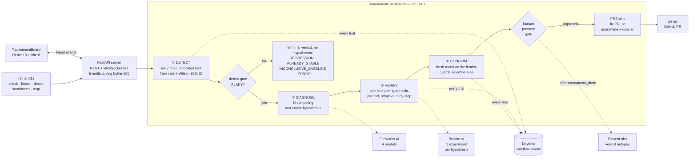
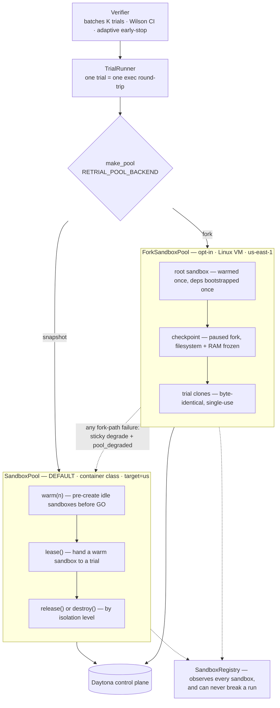
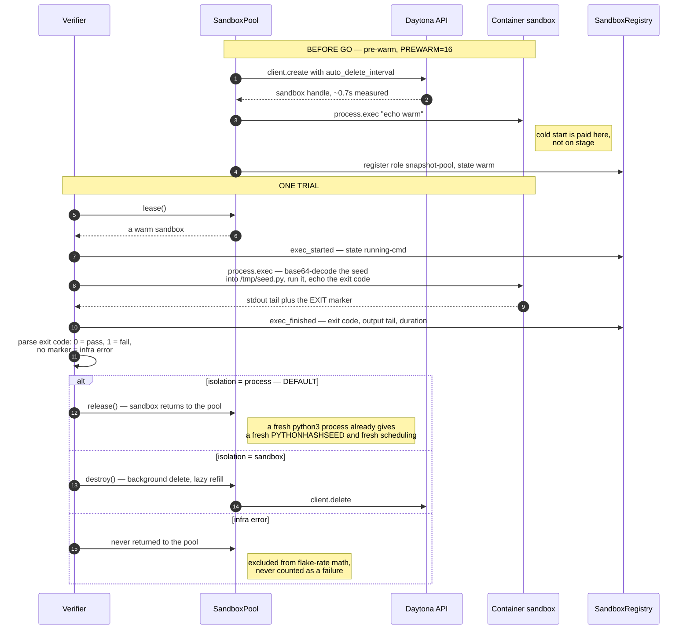
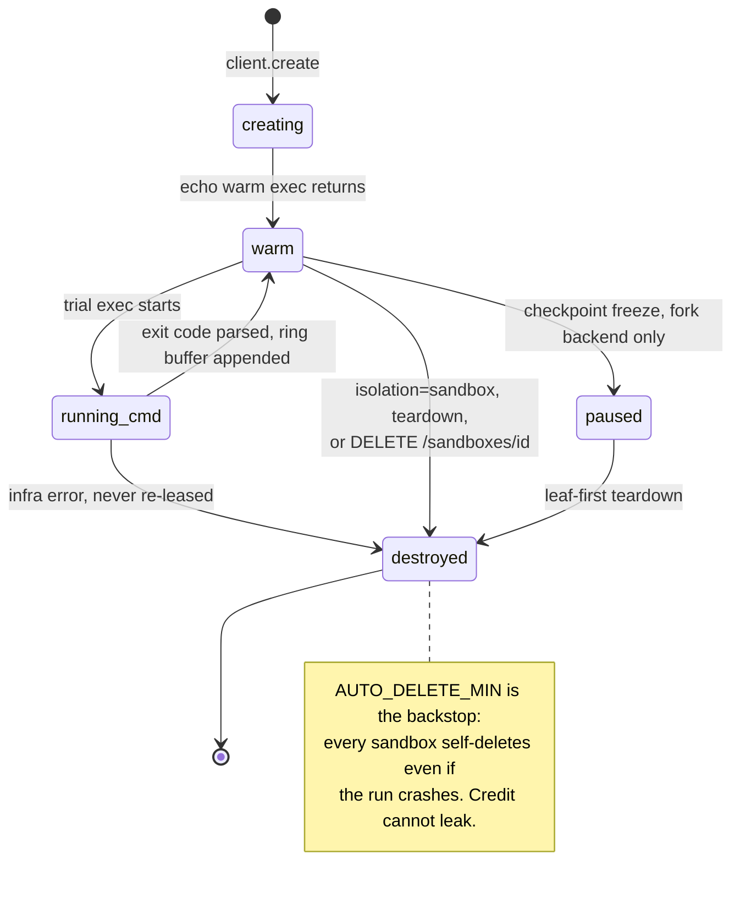
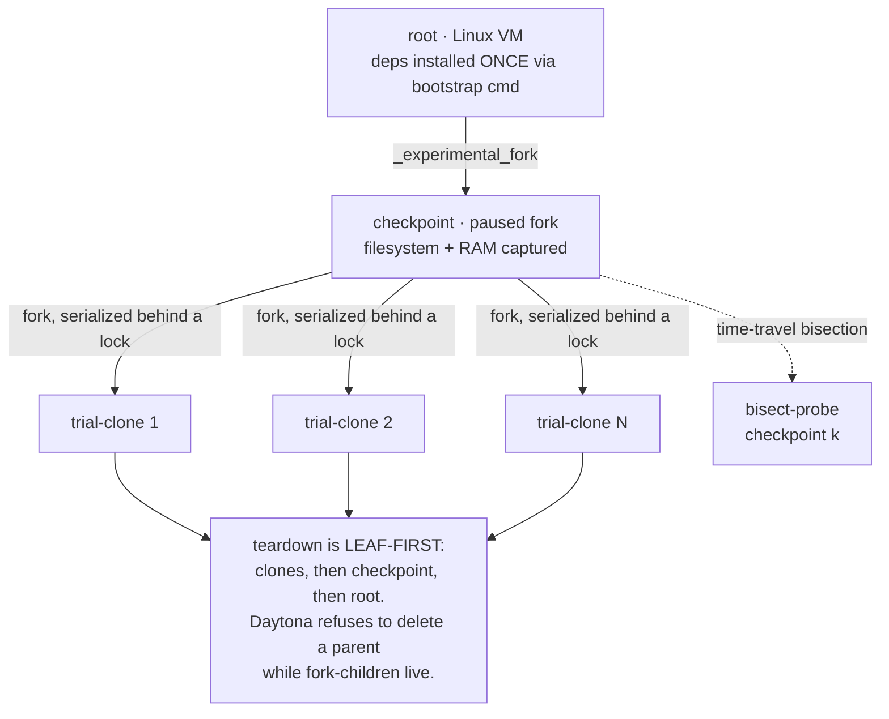
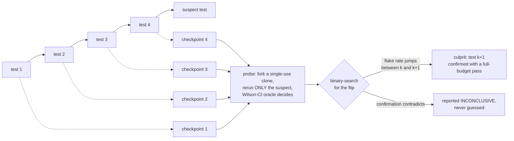

<div align="center">

# Retrial 🔁⚖️

### Your build isn't broken — it's lying. Retrial is the lie detector.

**A flaky-test lie detector and hypothesis tournament, running on a swarm of Daytona sandboxes.**

[](https://daytona.io)
[](https://fireworks.ai)
[](https://braintrust.dev)
[](https://elevenlabs.io)
[](https://cli.github.com)

[](https://python.org)
[](https://fastapi.tiangolo.com)
[](https://react.dev)
[](tests/)
[](tests/)
[](LICENSE)

Built for **Daytona HackSprint #5 — San Francisco, July 2026**

</div>

---

## 📋 Submission at a glance

| | |
| --- | --- |
| **What it is** | Point it at a flaky test. It measures the test's *empirical flake rate* across a Daytona sandbox swarm, races competing root-cause hypotheses against each other, and ships the statistically-proven winner as an evidence-backed PR. |
| **The thesis** | **Verification asymmetry.** Flaky tests are the one bug class where *verification*, not generation, is the bottleneck — a green run proves nothing at 44% flake. Everyone builds machines that generate fixes. We built the machine that **proves** them. |
| **Daytona's role** | **Load-bearing substrate.** Every statistical claim Retrial makes is backed by trials that ran in disposable Daytona sandboxes. No swarm, no product. See [How Retrial uses Daytona](#-how-retrial-uses-daytona-in-depth). |
| **Live, not staged** | Measured full tournament (detect + 2 hypotheses + confirm, 80 trials): **17.3s**. `run_started` → first trial: **0.60s**. The 3-minute demo is genuinely live. |
| **Never dead-ends** | No winner ⇒ a **quarantine PR** with the full evidence dossier. Worst case is still a real, useful workflow output. |
| **Honesty** | Every number in this README was measured in this repo, or is explicitly attributed to a cited source. See the [honesty ledger](#-honesty-ledger). |

---

## 🎯 The problem

Flaky tests pass and fail on the same code. A green run proves nothing when a test only fails 44% of the time — and every engineer's instinct is to hit rerun until it's green, which is exactly how a lie gets merged.

The incumbents (Bitbucket, Datadog, Kong all shipped flake fixers in 2026) detect flakes from **weeks of CI history** and then run **one** agent that guesses a cause. Retrial needs **sixty seconds** of sandboxes on any repo, and it doesn't guess — it runs a tournament and proves the winner.

## ⚖️ How it works — the four acts

1. **Detect (the lie detector).** Rerun the suspect test across a swarm of disposable [Daytona](https://daytona.io) sandboxes — a fresh environment per trial — and measure its **empirical flake rate** with a Wilson 95% confidence interval.
2. **Diagnose (differential diagnosis).** [Fireworks](https://fireworks.ai) frontier models generate *competing root-cause hypotheses* — order dependency, shared state, external dependency, timing — each with a candidate fix. The unit of competition is the **hypothesis**, not the model; multi-model is how we get hypothesis *diversity*.
3. **Verify (the tournament).** Every hypothesis' patch is re-trialed across the swarm, in parallel lanes. The winner isn't the one that *looks* right — it's the one that empirically survives, then survives again in a **fresh confirmation round** that guards against selection bias. Each hypothesis is a [Braintrust](https://braintrust.dev) experiment; the permalink is the receipt.
4. **Ship (human in the loop).** The winning fix — or an evidence-backed quarantine dossier — waits at a **promote gate** (React modal + `POST /promote`) until a human approves. Then PRSmith opens the PR via `gh api`, with flake rates, Wilson CIs, and Braintrust permalinks in the body.

An optional, collapsed-by-default **CopilotKit evidence navigator** explains the
current board state and can focus safe UI surfaces (Grid/Tree, Observatory,
Runs, a permitted demo seed, or the promotion review). It cannot start a run,
approve a promotion, open a PR, or destroy a sandbox.

> Every flaky test deserves a retrial. Fifty of them, actually.


*A live, fully-generated run, recorded as it happened: the diagnosis window (4 real Fireworks models proposing competing theories) → the tournament (one broken fix eliminated at 100% flake while the winner holds 0% across 40 reruns, 32 sandboxes live) → **44% → 0%, proven** with a real Braintrust receipt and the flake genome incrementing. Nothing staged.*


---

## 🏗️ Architecture

Python/FastAPI engine, React tournament board over WebSocket. The spine is event-driven: every stage emits a typed event, registered in `engine/retrial/events.py`, mirrored in `ui/src/types.ts`, and enforced by an AST-based emit-site scan in `tests/test_events.py` — the contract cannot silently drift.



**The detect-gate matters.** The tournament runs *only* when the detect verdict is FLAKY. An always-failing test gets `REGRESSION` — "fix the code, not the test" — not a fabricated fix. A stable test gets `ALREADY_STABLE`. No hypotheses, no PR, no theatre.

Full design notes: [docs/ARCHITECTURE.md](docs/ARCHITECTURE.md).

---

## 🧊 How Retrial uses Daytona (in depth)

Daytona isn't a deployment target here — it's the measuring instrument. Retrial's entire claim is statistical, and a statistical claim needs many independent, identical, disposable environments. That is the shape of the problem, and it's the shape of Daytona.

### Why a sandbox swarm is the *right* tool, not decoration

The obvious objection is "why not just run `pytest --count=50` locally?" Three reasons, and they're the whole design:

- **Shared-state flakes need a fresh environment**, not a fresh process. A test that leaks a file, a port, or an env var will pass locally on the second run for the wrong reason.
- **Statistics need throughput.** 4 hypotheses × 50 reruns = 200 executions. Serially that's a coffee break; at 16-concurrent it's ~33 seconds, which is what makes a *live* demo possible at all.
- **Identical starting universes.** Trial-to-trial variance must be the flake, not your laptop's thermal state. Disposable sandboxes from one snapshot give that for free — and the fork backend gives it *byte-identically*.

### Where Daytona plugs in



### One trial, end to end

The single most important performance decision in this repo: **write the seed and run it in ONE `process.exec` round-trip.** The exec round-trip — not sandbox creation — is the real per-trial cost. Collapsing two calls into one took throughput from 3.1 to 6.1 trials/s.



The exec, verbatim from `engine/retrial/trial.py`:

```python
b64 = base64.b64encode(test_code.encode("utf-8")).decode("ascii")
cmd = (f"echo '{b64}' | base64 -d > /tmp/seed.py && "
       f"python3 /tmp/seed.py; echo EXIT:$?")
r = sb.process.exec(cmd, timeout=timeout)
```

Base64, not a heredoc, on purpose: the payload is *model-generated patch code*. A heredoc sentinel or a stray shell metacharacter inside an LLM's patch could otherwise escape the write. Base64 has no shell-special characters, so the payload can never break out of its own decode.

### Isolation level, matched to flake class

This is a design decision, not a knob — and it's a stronger technical story than raw speed.

| Level | What a trial gets | Correct for | Measured throughput |
| --- | --- | --- | --- |
| `process` **(default)** | A warm pooled sandbox, fresh `python3` process → fresh `PYTHONHASHSEED`, fresh scheduling | Order-dependency and scheduling flakes | **6.1 trials/s** |
| `sandbox` | A brand-new sandbox, destroyed after one trial | State-polluting flakes: filesystem, port, env | **2.7 trials/s** |

An infra error **never** returns its sandbox to the pool, at either level — a broken sandbox must not serve another trial. Infra errors are tracked separately (`errors`) and excluded from flake-rate math entirely. They are never silently counted as failures.

### Sandbox lifecycle, as the registry sees it



### Fork lineage — the Rewind engine

With `RETRIAL_POOL_BACKEND=fork`, provisioning inverts: instead of N independent sandboxes, warm **one** root, freeze it as a checkpoint, and fork N byte-identical clones from that checkpoint.



Fork issuance is **serialized behind a lock** — concurrent forks from the same parent return `409 Conflict`, so the only proven usage is strictly sequential, and a mocked-SDK stress test pins that discipline in place. On **any** fork-path failure the pool degrades — stickily — to the snapshot pool, emits `pool_degraded`, and the UI raises a red banner that never auto-dismisses. Silent degradation on stage is the disaster that design prevents.

### Every Daytona API Retrial calls, and why

| Daytona call | Where | Why it's there |
| --- | --- | --- |
| `Daytona(DaytonaConfig(target=...))` | `pool.py`, `forkpool.py`, `bisect.py` — one client per pool | Containers in `us`; fork VMs in `us-east-1`. Region is resolved through `settings.py`, never hardcoded. |
| `client.create(CreateSandboxFromSnapshotParams(...))` | `SandboxPool._create`, `ForkSandboxPool.warm`, `FlakeBisector` root | Every pool sandbox and every fork root. |
| `auto_delete_interval=AUTO_DELETE_MIN` | passed on **every** create, in all three modules | **Credit safety.** Sandboxes self-delete, so a crashed run can't leak spend. |
| `network_block_all=True` **at create time** | `pool.py`, `forkpool.py` | The hermetic sub-pool for the network-blocked second detect pass. Set at create, *never* on a running sandbox — that kills the SDK control channel. |
| `sandbox.process.exec(...)` | `trial.py` (the trial), pool warm-ups (`echo warm`), `bisect.py` (probes) | The measurement itself, and the warm-up that pays cold-start before GO. |
| `sandbox._experimental_fork(...)` | `forkpool.py` (checkpoint + clones), `bisect.py` (checkpoint + probes) | Byte-identical clones. Serialized behind a lock; retried on 409. |
| `sandbox.pause()` | `forkpool.py`, `bisect.py` | Freezes a checkpoint — the paused fork-child captures filesystem **and** RAM. |
| `sandbox.get_preview_link(port)` | `registry.py` | The Observatory's preview button — resolved lazily, `None` when Daytona exposes no link, and we say so rather than inventing one. |
| `client.delete(client.get(id))` | `pool.py`, `forkpool.py`, `bisect.py` — always from a `finally` | Teardown, leaf-first. Every path that creates a sandbox deletes it. |

### Measured on Daytona — cite these, not estimates

| Measurement | Value | Notes |
| --- | --- | --- |
| Container sandbox create | **~0.7s** | End-to-end incl. SDK round-trip, `target="us"` |
| 16 concurrent creates | **~2.0s** | The fan-out beat |
| Trial throughput, `process` isolation | **6.1 trials/s** | ~200 trials ≈ 33s |
| Trial throughput, `sandbox` isolation | **2.7 trials/s** | Create-bound, as expected |
| True unit cost | **~5s per 16-concurrent batch of execs** | Exec round-trips dominate, *not* create |
| Pre-warm effect | `run_started` → first trial **0.60s** | Was 12.5s cold |
| Full tournament, 80 trials | **17.3s** | detect + 2 hypotheses + confirm, verdict FIXED |
| Live 4-model Fireworks diagnosis | **23–29s** | Parallel, bounded by the slowest model |
| Fully-generated run | detect **44%** (7/16, CI 23–67%) → winner **0/24** (CI ≤14%) | 3 of 4 models correctly identified the order dependency; the "timing" hypothesis stayed 56% flaky and was eliminated |

Fork-primitive timings are **not** in this table on purpose — see the [honesty ledger](#-honesty-ledger).

### Daytona facts we learned the hard way

Verified live, documented in [docs/DAYTONA-COOKBOOK.md](docs/DAYTONA-COOKBOOK.md), and worth knowing before you build on the platform:

- **Concurrent forks from one parent return `409 Conflict`** — only one of four succeeds. Forks must be sequential with retry-on-409. Do not promise an audience "one sandbox becomes four instantly."
- **`network_block_all=True` on a *running* sandbox can kill the SDK control channel.** Lock the network at create time via `domain_allow_list` instead.
- **Write to `/tmp` on containers, `/root` on VMs.** Sandboxes run as a non-root user; `/` and `/work` are permission-denied.
- **Linux VM snapshots are region-specific.** The `ubuntu:22.04` base is bare — no `python3`, no `curl`. Install tooling in the root **once**, then fork; every clone inherits it.
- **`sandbox.copy()` is a Pydantic model-copy, not a fork.** The real fork lives on the low-level `SandboxApi`.
- **Deleting a parent with live fork-children fails.** Always tear down leaf-first.

---

## ⏪ The Rewind engine: fork-checkpoints & time travel

Two capabilities come from merging in the Rewind execution-search engine:

- **Fork-based provisioning** (`RETRIAL_POOL_BACKEND=fork`): the topology diagrammed above. Identical initial state means trial-to-trial variance is purely the flake, not provisioning noise. On any fork-path failure the pool degrades automatically and stickily to the snapshot pool and emits `pool_degraded` — the UI shows an honest "snapshot fallback" tag. Default stays `snapshot`.
- **Time-travel flake bisection** (`retrial bisect` / `POST /bisect`): for order-dependency flakes, run the suite prefix in a live root sandbox while freezing a checkpoint at every test boundary, then rerun ONLY the suspect from each checkpoint with the same Wilson-CI oracle, binary-searching to the exact test that poisons it.



Honest limitations, stated in `--help` too: bisection **requires** the fork backend (there is no snapshot fallback — the capability *is* the fork), and it assumes the flake rate is a monotonic step function across checkpoints. Noisy probes are mitigated by a full-budget confirmation pass, and a contradicted confirmation reports inconclusive rather than guessing.

---

## 🔭 Sandbox Observatory: see inside the swarm

Visibility is the headline. A thread-safe `SandboxRegistry` tracks **every** sandbox Retrial ever touches — pool sandboxes, fork roots/checkpoints/trial-clones, and bisect probes — with its role, lifecycle state, fork-lineage parent, the command it is running right now, a bounded ring of recent execs (commands, exit codes, output tails), per-sandbox exec counts, and a Daytona **preview link when Daytona exposes one** (`get_preview_link`; `None` otherwise — paused sandboxes are retried on the next open, not cached as failed). Observability never breaks a run: every registry hook is wrapped so a failure is swallowed, and the pools/bisector behave identically with a broken or absent registry.

The registry streams typed events (`sandbox_registered`, `sandbox_state`, `sandbox_exec`, `sandbox_destroyed`, `registry_snapshot`) over the existing `/ws`, and exposes:

- `GET /sandboxes` — full snapshot: every live sandbox plus the most-recently-destroyed, the fork-lineage tree, and exact `live` / `total-ever` / `destroyed` counts. `/sandboxes` returns all live sandboxes **plus the 50 most-recently-destroyed** (env `RETRIAL_DESTROYED_RETAIN`); the live/total-ever/destroyed counters are **exact regardless** of that window. The included resource meter is a **count-based estimate** — Daytona does not provide per-sandbox RAM metrics here, and we do not claim it.
- `GET /sandboxes/{id}` — full detail incl. the scrolling exec history and the lazily-resolved preview link.
- `DELETE /sandboxes/{id}` — destroy ONE sandbox. Deleting one sandbox mid-run is a **safe resilience demo**: the trial layer excludes the resulting infra error and never re-leases it. It refuses (409) if the sandbox has live fork-children — destroy leaves first.
- `POST /sandboxes/destroy_all` — leaf-first teardown of every live sandbox. **409 while a run is active unless `?force=1`.** `destroy_all?force=1` is a *different class of operation* from a single DELETE: it **cancels an active bisect run cooperatively** (the run stops at its next probe and tears down its own resources leaf-first) and tears down the tournament pools under a fork lock, after which the run's remaining trials fail as **infra-excluded** — the run does **not** silently continue on rebuilt sandboxes.
- CLI: `retrial sandboxes` (a table of every tracked sandbox) and `retrial reap` (`--force` to cancel an active run and reap). Both are thin HTTP clients of the running engine.

The registry is deliberately **not** reset at run acceptance — live sandboxes and the total-ever/destroyed counters span runs because the pool is shared across runs. Instead, each accepted run re-broadcasts a `registry_snapshot` right after the bus reset, so a board that connects mid-run reconstructs the sandbox world instead of seeing a stale, half-evicted tail.

### The Observatory panel (UI)

The tournament board carries an **⬢ Observatory** toggle (top-right) that opens the backstage panel: a role-grouped **live grid** of sandbox cards (state color + a pulse on every exec), a **fork-lineage tree** (root → checkpoint → clones/probes, derived from `parent_id`), a per-sandbox **detail drawer** (full record, a scrolling exec feed with commands / exit codes / output tails, and a **preview-link button** that opens the Daytona preview in a new tab **when one is exposed** — otherwise an honest "no preview link" note), and a header strip with the live / total-ever / destroyed counters plus a **Destroy-all** button (confirm modal; live-only, and while a run is active its force checkbox spells out the consequences — a bisect stops at its next probe, a tournament's remaining trials fail as infra-excluded). Per-card ✕ destroy buttons map to `DELETE /sandboxes/{id}`.

Demo URLs (all opt-in behind query params; the **default URL is byte-for-byte the untouched replay** and its Observatory is a labeled **replay reconstruction** — a read-only view *derived from the recorded trial events*, not recorded registry data):

- default (no params) — the recorded winner run; Observatory shows the labeled reconstruction.
- `?mock=observatory` — the recorded run with a scripted registry feed interleaved: cards churn live, the fork tree grows root → checkpoint → clones, and a mid-run destroy wave reaps the non-reusable clones.
- `?mock=bisect` / `?mock=promote` / `?mock=quarantine` — the other scripted demos, unchanged.
- `?live=1` — connect to the live engine; the Observatory reads the real registry over `/ws` and the destroy controls act on real sandboxes.

---

## 📊 The statistics (non-negotiable)

The swarm is only worth building if the math on top of it is honest.

- **Wilson 95% confidence intervals everywhere a rate is shown.** `0/50` is reported as **"≤7% at 95% confidence"**, never as "0%". This binds the *spoken* narration too, not just the UI.
- **Adaptive early-stop.** A lane stops as soon as its CI fully excludes the decision threshold. This is why a real tournament fits inside a 3-minute demo.
- **Winner selection then confirmation.** The winner is the lowest flake rate whose CI upper bound sits below the original's rate — *then* a **fresh confirmation round** re-verifies it independently, because picking the best of N candidates is itself a selection bias.
- **No winner ⇒ QUARANTINE**, with the evidence dossier. The run never dead-ends.
- **A neutering guard** disqualifies patches that "fix" the test by gutting it — `sys.exit(0)`, `assert True`, deleted assertions. A fix has to actually pass, not surrender.
- **Never `rate or default`.** A measured `0.0` is falsy in Python, and that bug once made a narrator announce "flaked 100 percent" for a candidate the board showed at 0%. Every rate lookup uses an explicit `is None` check. Fabricating a number is worse than showing none.

---

## 🤝 Sponsor integrations (all of them, truthfully)

Only integrations with a **real code path** are claimed. The bar for the "Integrated" table is: name the module.

| Sponsor | Role | Module | Verification |
| --- | --- | --- | --- |
| **Daytona** | The substrate — snapshot pool, fork/pause checkpoint engine, every trial | `pool.py`, `forkpool.py`, `bisect.py`, `trial.py`, `registry.py` | Snapshot-pool timings measured live; fork path exercised against a **mocked SDK** in CI, plus a manual live smoke |
| **Fireworks AI** | Differential diagnosis — 4 competing hypotheses from round-robined models (OpenAI-compatible API) | `diagnosis.py` | Real code path, requires `FIREWORKS_API_KEY`; JSON parsing unit-tested; no key ⇒ detect-only, honestly |
| **Braintrust** | Evidence ledger — one experiment per hypothesis, one log per trial; the permalink is the receipt | `ledger.py`, tracing in `server.py`/`cli.py` | Optional; with no key every ledger call is a silent no-op |
| **CopilotKit** | Optional evidence navigator — loopback Node runtime, read-only engine tools, safe UI focus only | `ui/copilot/`, `ui/src/copilot/` | Feature-flagged (`VITE_COPILOT_ENABLED`); never GO/promote/destroy |
| **ElevenLabs** | Spoken verdict autopsy after `tournament_done`, **output only** | `narrator.py`, `ui/src/components/NarrationPlayer.tsx` | `NARRATE=1`, default OFF. Script is **templated from the dossier**, never LLM-written, so speech cannot drift from the board. Failures degrade to silence, never to a failed run |
| **GitHub (`gh` CLI)** | PRSmith opens fix/quarantine PRs server-side, behind the human promote gate | `prsmith.py` | Never touches the local working tree — `gh api` ref/blob/PR |

**Disclosed workflow, not an engine integration:** *CodeRabbit* — its GitHub App can review the PR PRSmith opens. There is no SDK call in this repo, and review latency is 1–5 minutes, so any demo use is **pre-run and disclosed unprompted**, never claimed as live on-stage turnaround.

Everything above is exercised by the mocked-SDK suite in `tests/` (229 tests, `pytest`, **no credentials required**). Anything needing live keys is labelled as such.

---

## 🚀 Quickstart

```bash
python3 -m venv .venv && .venv/bin/pip install -r requirements.txt -r requirements-dev.txt
cp .env.example .env   # fill in keys

.venv/bin/python -m pytest tests/ -q                        # 229 tests, mocked SDK, no keys needed
.venv/bin/python -m retrial.cli doctor                      # config check, offline, instant

# live (needs DAYTONA_API_KEY):
.venv/bin/python scripts/calibrate_seeds.py                 # measure seed flake rates ON Daytona
.venv/bin/python -m retrial.cli check seeds/test_dict_order.py    # the calibrated primary seed
.venv/bin/python -m retrial.cli bisect seeds/suites/order_pollution   # time-travel bisection, fork backend
```

Then the full stack:

```bash
uvicorn retrial.server:app --port 8000     # engine
cd ui && npm run dev                       # board at localhost:5173 (append ?live=1 for the engine)
```

> **Seed law:** a seed is only usable once it's been **calibrated on Daytona** — local flake rates are meaningless here (different CPython, different CPU constraints). The primary seed `seeds/test_dict_order.py` is calibrated IDEAL at 42–51% across rounds. Thread/timing race seeds were measured at **0 flakes in 120 trials** on this substrate, so Retrial never claims to reproduce race conditions.

> **Demo-config law:** any run that must reach a `FIXED` verdict needs **`MAX_TRIALS >= 40`** (50 recommended). The CI-upper rule is strict: 0/40 → upper 8.76% < 10% ✓ FIXED, but 0/16 → upper ~19% ✗ INCONCLUSIVE → QUARANTINE, *even for a perfect fix*. Never demo at 16–24 trials expecting FIXED.

The API server binds **127.0.0.1** by default — it has no auth and wide-open CORS, so it must stay on loopback. Set `HOST=0.0.0.0` only behind a trusted proxy. `POST /tournament` only accepts `seed_path`s that resolve inside `seeds/`, and `POST /bisect` only accepts `suite_dir`s inside it.

### Tournament Board + CopilotKit

The board still works without the copilot. `VITE_COPILOT_ENABLED=0` is the
safe default: no CopilotKit UI is mounted and a missing AI runtime cannot take
down the tournament.

To run the live board with the evidence navigator:

```bash
# Terminal 1, from the repository root
cd engine && ../.venv/bin/uvicorn retrial.server:app --host 127.0.0.1 --port 8000

# Terminal 2, after setting FIREWORKS_API_KEY and VITE_COPILOT_ENABLED=1 in .env
cd ui && npm install && npm run dev
```

`npm run dev` starts Vite on `127.0.0.1:5173` and the CopilotKit runtime on
`127.0.0.1:4000`; Vite proxies `/api/copilotkit`, so the browser never receives
`FIREWORKS_API_KEY`. Open `http://127.0.0.1:5173/?live=1`, then choose **Ask**
from the top bar. Chat memory is intentionally per page load. For isolated
debugging, `npm run dev:ui` starts Vite only and `npm run dev:copilot` starts
the CopilotKit runtime only. The Python engine remains a separate process.

The runtime's engine tools are read-only (`GET /health`, `GET /preflight`, and
`GET /runs`). Frontend tools may reveal or focus an existing UI control, but
they never call `POST` or `DELETE`. The human still presses **GO**, approves a
promotion, and confirms destructive sandbox actions. Keep all three services
on loopback; this local hackathon runtime is not an authenticated public API.

### Configuration reference

Engine env vars are read through one typed
[`pydantic-settings`](https://docs.pydantic.dev/latest/concepts/pydantic_settings/)
surface (`engine/retrial/settings.py`) — parsed and validated once, never
scattered. Names are frozen (no renames); `get_settings()` constructs fresh on
every call so per-run `monkeypatch.setenv` and live re-reads still work; a
malformed value (e.g. `MAX_TRIALS=abc`) is recovered to the default and
surfaced as a loud `settings_parse` failure rather than crashing boot. The
Copilot rows below belong to the separate local Node/Vite surface.

| Env | Default | Consumer | Meaning |
| --- | --- | --- | --- |
| `DAYTONA_API_KEY` | *(none)* | Daytona SDK | provisioning key. Live runs + the fork engine require it; replay demos don't |
| `DAYTONA_TARGET` | `us` | snapshot pool / bisect | Daytona region for the snapshot pool and bisect root |
| `RETRIAL_FORK_TARGET` | `DAYTONA_TARGET` → `us-east-1` | fork pool | region for fork VMs — **verified only in `us-east-1`** |
| `RETRIAL_FORK_SNAPSHOT` | `daytona-vm-small` | fork pool | Linux VM snapshot that supports `_experimental_fork` |
| `RETRIAL_FORK_BOOTSTRAP_CMD` | *(empty)* | fork pool | optional command baked once into the fork root (repo/deps/hot caches) |
| `RETRIAL_POOL_BACKEND` | `snapshot` | `make_pool` | `fork` = the Rewind engine (auto-falls back to snapshot, emits `pool_degraded`) |
| `RETRIAL_MAX_FORKS` | `64` | fork pool | spend guard: max live fork clones before a fork is refused |
| `AUTO_DELETE_MIN` | `60` | all pools / bisect | belt-and-braces sandbox auto-delete window (minutes) |
| `MAX_TRIALS` | `50` (`check`) / `30` (`bisect`) | server / CLI | max reruns per detect/probe |
| `CONC` | `16` (`check`) / `8` (`bisect`) | server / CLI | concurrent sandboxes |
| `TOURNAMENT_CONC` | `8` | server | per-lane concurrency in the parallel hypothesis phase |
| `THRESHOLD` | `0.10` | server / CLI | flake-rate decision threshold (matches the UI's 10% marker) |
| `ISOLATION` | `process` | server | `process` (reuse warm sandboxes) or `sandbox` (fresh per trial) |
| `PREWARM` | `16` | server | boot pre-warm pool size; `0` disables |
| `HERMETIC_PREWARM` | `8` | server | hermetic sub-pool pre-warm size |
| `PRSMITH` | `0` | server | enable PR opening after a verdict (`""` also enables — legacy `!= "0"` rule) |
| `PROMOTE_GATE` | `1` | server | human approval via `POST /promote` before PRSmith; `0` = auto-PR |
| `HERMETIC` | `0` | coordinator / server | second network-blocked detect pass for external-dep flakes |
| `LEDGER` | `1` | ledger | Braintrust evidence ledger on/off (needs `BRAINTRUST_API_KEY`) |
| `RETRIAL_PREFLIGHT_LIVE` | `0` | server | `1` runs the **real** live fork deep check at boot (Daytona calls) |
| `FIREWORKS_API_KEY` | *(none)* | diagnosis | Fireworks key; absent = detect-only (no hypotheses) |
| `FIREWORKS_MODELS` | *(empty)* | diagnosis | comma-separated model slugs (round-robined) |
| `VITE_COPILOT_ENABLED` | `0` | UI | `1` mounts the optional CopilotKit evidence navigator |
| `COPILOT_RUNTIME_PORT` | `4000` | Copilot runtime | loopback port proxied by Vite at `/api/copilotkit` |
| `COPILOT_MODEL` | first `FIREWORKS_MODELS` entry, then `accounts/fireworks/models/glm-5p2` | Copilot runtime | Fireworks model used by the navigator |
| `COPILOT_MAX_OUTPUT_TOKENS` | `800` | Copilot runtime | response ceiling for concise evidence explanations |
| `COPILOTKIT_TELEMETRY_DISABLED` | `true` in `.env.example` | Copilot runtime | keeps the local evidence navigator from sending anonymous runtime telemetry |
| `RETRIAL_ENGINE_URL` | `http://127.0.0.1:8000` | Copilot runtime | origin for its bounded read-only engine tools |
| `BRAINTRUST_API_KEY` | *(none)* | ledger / tracing | absent = evidence ledger disabled |
| `NARRATE` | `0` | narrator / server | `1` = speak the verdict autopsy after `tournament_done` (needs `ELEVENLABS_API_KEY`) |
| `ELEVENLABS_API_KEY` | *(none)* | narrator | absent = narration silently skipped (preflight warns if `NARRATE=1`) |
| `ELEVENLABS_VOICE_ID` | Matilda | narrator | override the narration voice |
| `ELEVENLABS_MODEL_ID` | `eleven_v3` | narrator | v3 is the model with emotional audio-tag support |
| `RETRIAL_REPO` | *(gh detect)* | prsmith | `owner/repo` target for opened PRs |
| `GENOME_PATH` | `genome.json` | genome | flake-genome store path |
| `RETRIAL_EXEC_HISTORY` | `20` | registry | per-sandbox ring size of recent execs kept for the Observatory |
| `RETRIAL_DESTROYED_RETAIN` | `50` | registry | recently-destroyed records `/sandboxes` retains (counters stay exact) |
| `RETRIAL_PREVIEW_PORT` | `8080` | registry | port used when resolving a sandbox's Daytona preview link |
| `RETRIAL_AUTH_TOKEN` | *(none)* | server | optional Bearer gate on mutating endpoints (see **Auth** below) |
| `RETRIAL_EST_RATE_PER_SANDBOX_HOUR` | *(none)* | registry / server | rate for the clearly-labeled spend **estimate**; unset = no `$` |
| `RETRIAL_DB` | `.retrial/history.db` | history / server | run-history SQLite path (gitignored; WAL sidecars live alongside it) |
| `HOST` / `PORT` | `127.0.0.1` / `8000` | server | uvicorn bind (loopback by default — no auth + open CORS) |

Endpoints and commands: `python -m retrial.cli bisect seeds/suites/order_pollution`, `POST /bisect`, `POST /promote`, `GET /sandboxes`, `GET /sandboxes/{id}`, `DELETE /sandboxes/{id}`, `POST /sandboxes/destroy_all` (409 while a run is active unless `?force=1`), `GET /runs`, `GET /narration/{run_id}`, `retrial sandboxes`, `retrial reap`.

---

## 🛡️ Operational hardening

### Doctor & preflight

`python -m retrial.cli doctor [--live]` validates config end-to-end with a `PASS`/`WARN`/`FAIL` line per check (key present, region, snapshot names, backend selection, promote gate, Fireworks/Braintrust/gh presence-or-absence stated honestly), exiting non-zero on any failure. The server runs the same config-level checks at boot, exposes them at `GET /preflight`, and emits a typed `preflight_done` event; **any `pool_degraded` at any time surfaces as a persistent red banner in the UI** — silent degrade on stage is the disaster this prevents. A failed preflight is a loud banner, never a dead server (replay demos boot with zero config).

Config checks are **offline** (pure, instant, no key needed). `doctor --live` and `RETRIAL_PREFLIGHT_LIVE=1` perform **real Daytona calls** (~1 sandbox-minute, budget-capped: create → fork → exec → teardown) — the shared deep-check code path, wrapped in a hard outer timeout so a wedged SDK call can never hang.

### Loud degrade banner

Any `pool_degraded` at **any** time — the fork backend falling back to the snapshot pool — or a failed boot preflight surfaces as a **persistent red banner** rendered at the board root, so it shows in *every* view (diagnosing, grid, tree, bisect rail, observatory), not just the Observatory. It never auto-dismisses and has no close button. The banner is event-driven (`pool_degraded` / `preflight_done`) and both facts are **sticky**: the server re-seeds them into every fresh replay buffer at run acceptance (inside the run lock), so a client connecting during run 2 still learns the pool degraded during run 1. Warn-only preflight checks render a slim amber strip instead. Degrade wins over a failed preflight (loudest fact first).

### Spend meter

`GET /sandboxes` (and every `registry_snapshot`) carries a `spend` object and the Observatory header shows a small **`est.`** chip. What is measured: **our own monotonic sandbox-lifetime seconds** (created → destroyed), accumulated exactly-forever in the registry so pruning old destroyed records never loses seconds. What is **not**: Daytona billing data — we never claim it. `est_cost_usd` is a **clearly-labeled estimate** = measured sandbox-hours × an env-configured rate (`RETRIAL_EST_RATE_PER_SANDBOX_HOUR`); it is `null` when no rate is set (the chip then nudges you to set the var rather than inventing a price). Seconds are integers, cost is to the cent — no fake precision, and the chip is hidden entirely in the default replay / reconstruction (no recorded lifetimes → no invented money).

### Auth (optional)

Setting `RETRIAL_AUTH_TOKEN` requires `Authorization: Bearer <token>` on the mutating endpoints (`POST /tournament`, `POST /bisect`, `POST /promote`, `DELETE /sandboxes/{id}`, `POST /sandboxes/destroy_all`); read-only endpoints and `/ws` stay open. Unset (the default), behavior is unchanged. **API/CLI-only.** The web UI does not send tokens — with `RETRIAL_AUTH_TOKEN` set, mutating buttons in the UI will be rejected with 401 (each shows an explicit auth-gate message). Enable it for headless/API demos, not UI demos. Comparison is exact-string on loopback; no constant-time guarantee is claimed.

### Run history

Every completed run (tournament or bisect) is recorded to a small stdlib-`sqlite3` table at `RETRIAL_DB` (default `.retrial/history.db`, gitignored). `GET /runs?limit=N` (read-only, not auth-gated, `limit` clamped 1–100) returns the recent runs newest-first — id, kind, test name, verdict, flake rates, winner model, Braintrust link, timestamps — and the UI's collapsible **Runs** panel (a `☰ Runs` toggle in the top bar) lists them read-only. The panel is **live-only** (replay has no database, and says so honestly); empty history shows "no completed runs yet", never an error. Persistence follows the registry rule: **it can never break a run.** The write runs from a `finally`, after the verdict/terminal-event/promote/PR logic, behind a call-site guard *on top of* the swallow-everything `_safe` decorator (two layers) — a history failure costs the row, never the verdict. Every connect sets `PRAGMA journal_mode=WAL` + `busy_timeout=250`, so a `GET /runs` landing as a run commits reads last-committed state instead of queueing behind the writer (single-row INSERT on WAL — sub-10ms; a demo-time pause is never a hang).

### Live smoke

`scripts/live_smoke.py` proves the **production fork-pool path** against real Daytona: `ForkSandboxPool.warm(2)` → assert *not* degraded (`backend == "fork"`) → lease a clone and exec the trial one-liner (`print(42)`) → assert registry fork-lineage (one root, one checkpoint parented to it, ≥2 trial-clones parented to the checkpoint) → `destroy_all` and assert zero live. It is **manual/dispatch only** (`.github/workflows/live-smoke.yml`, `workflow_dispatch`), never wired to push/PR (CI stays credential-free), using secret `DAYTONA_API_KEY`. Budget-capped: fail-fast SKIP (exit 2) with no key before any SDK construction; `RETRIAL_MAX_FORKS` capped ≤4; `auto_delete_min=10`; and a hard `LIVE_SMOKE_TIMEOUT` (default 300s) timer that best-effort tears down then `os._exit`s. This is intentionally a *separate* live path from `doctor --live` / `RETRIAL_PREFLIGHT_LIVE=1` (which prove the raw SDK create/fork/exec sequence) — the pool flow supersets those operations, so merging them would double spend for no extra evidence. Live verification must run **both**.

### PR receipts

PRSmith dossiers include a **`## Statistical receipts`** section: the before (detect) empirical flake rate + Wilson 95% CI + reruns; the after (winner) and confirmation-round rates + CIs + reruns for a `FIXED` verdict (with the explicit note that confirmation was an independent re-verify); the best-candidate rate + CI for a `QUARANTINE`; Braintrust experiment permalinks as markdown links **when present**; and a method footer. Wording discipline: **a line renders only when its datum exists** — absent data says nothing (no `n/a`-as-evidence, no claim without a measurement; a missing Braintrust ledger states its own absence honestly).

---

## ✅ Honesty ledger

Judges at this event include the engineers who built these tools, so the rule is simple: **never state a number that wasn't measured in this repo.**

| Claim | Status |
| --- | --- |
| Snapshot-pool timings (create, concurrency, trials/s, tournament wall-clock) | **Measured live in this repo.** Sources: [docs/WINNING-IDEA.md](docs/WINNING-IDEA.md) "MEASURED DEMO-TIMING TRUTH", [docs/DAYTONA-COOKBOOK.md](docs/DAYTONA-COOKBOOK.md), `calibration-results.json` (gitignored — regenerate it) |
| Seed flake rates | **Measured on Daytona**, not locally. Local rates are meaningless on this substrate |
| Fork-primitive timings | **Cited as the Rewind project's spike results**, clearly attributed, *not* re-verified here. That's why they're absent from the measured table |
| The fork code path | Exercised against a **mocked Daytona SDK** in CI (no live keys in CI), plus a manual live smoke run |
| "We reproduce race conditions" | **Never claimed.** Thread/timing races measured 0 flakes in 120 trials on this substrate. Retrial says "scheduling-dependent flakes" only where that's true |
| Per-sandbox RAM / cost | **Not claimed.** The resource meter is a count-based estimate; the spend chip is our own measured sandbox-seconds × a configured rate, never Daytona billing data |
| Anything pre-computed for a demo | Cached hypotheses and pre-run CodeRabbit reviews are **disclosed unprompted**, never passed off as live |

---

## 📚 Docs

Full strategy, research, and verified Daytona findings live in [docs/](docs/):

| Doc | What's in it |
| --- | --- |
| [WINNING-IDEA.md](docs/WINNING-IDEA.md) | Product source of truth — the pitch, the demo script, the measured timing table |
| [ARCHITECTURE.md](docs/ARCHITECTURE.md) | Component-by-component design and provenance |
| [DAYTONA-COOKBOOK.md](docs/DAYTONA-COOKBOOK.md) | **Verified Daytona SDK patterns** — copy these, don't rediscover them |
| [SPONSORS.md](docs/SPONSORS.md) | The honest integration list; the bar is "name the module" |
| [SPIKE-RESULTS.md](docs/SPIKE-RESULTS.md) | Raw live-spike measurements |
| [EVENT-RULES.md](docs/EVENT-RULES.md) | Official hackathon rules |

---

<div align="center">

**MIT licensed.** Built with Daytona, Fireworks AI, Braintrust, ElevenLabs, and a great deal of statistical paranoia.

</div>
