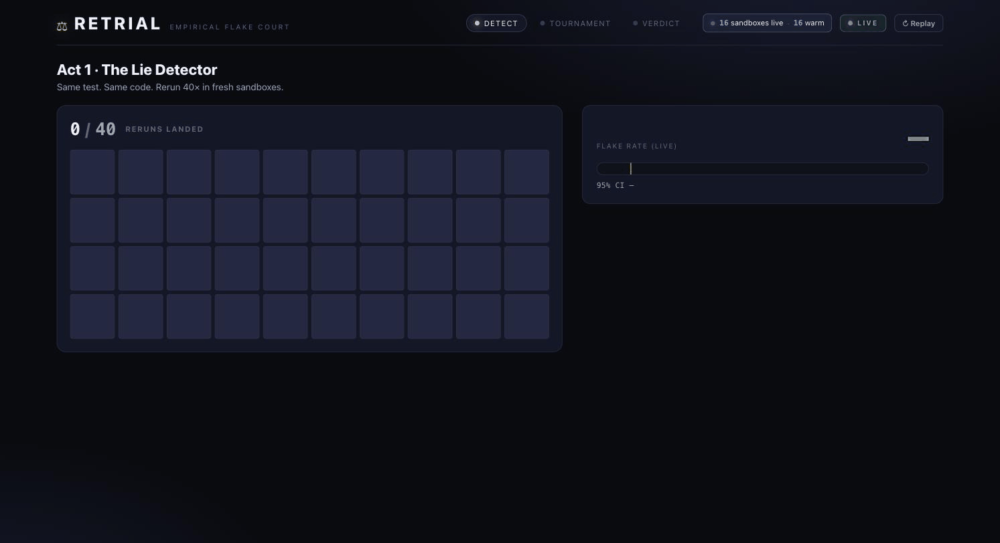
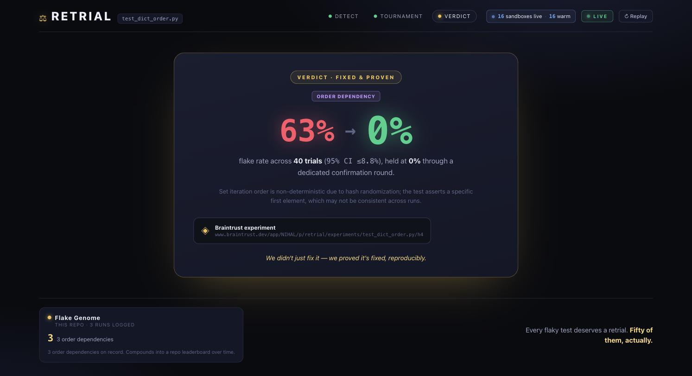

# Retrial 🔁⚖️

**Retrial** — a flaky-test tournament, **powered by the Rewind engine**: Daytona fork-checkpoints give every trial a byte-identical starting universe, and time-travel bisection replays the suite from any checkpoint to pinpoint the test that poisons another. Rewind is the engine inside Retrial, not a separate product.

**Your build isn't broken — it's lying. Retrial is the lie detector.**

Flaky tests pass and fail on the same code. A green run proves nothing when a test only fails 40% of the time — verification, not generation, is the bottleneck. Retrial fixes that with statistics:

1. **Detect (the lie detector):** rerun a suspect test across a swarm of disposable [Daytona](https://daytona.io) sandboxes — fresh environment per trial — and measure its **empirical flake rate** with a Wilson confidence interval, in about a minute. Incumbents need weeks of CI history; Retrial needs sixty seconds.
2. **Diagnose (differential diagnosis):** [Fireworks](https://fireworks.ai) frontier models generate *competing root-cause hypotheses* (race condition, order dependency, timing, shared state) — each with a candidate fix.
3. **Verify (the tournament):** every hypothesis' fix is re-trialed across the swarm. The winner isn't the one that *looks* right — it's the one that empirically survives (48% flake → 0/50 failures, confirmed by a fresh round). Every trial is logged as a [Braintrust](https://braintrust.dev) experiment — the dashboard is the scoreboard, the permalink is the receipt.
4. **Ship (human in the loop):** the winning fix (or an evidence-backed quarantine dossier) waits at a promote gate — a React modal + FastAPI `/promote` endpoint — where a human approves before PRSmith opens the PR via `gh api`, with the flake rates, Wilson CIs, and Braintrust permalinks in the PR body.

> Every flaky test deserves a retrial. Fifty of them, actually.


*A live, fully-generated run, recorded as it happened: the diagnosis window (4 real Fireworks models proposing competing theories) → the tournament (one broken fix eliminated at 100% flake while the winner holds 0% across 40 reruns, 32 sandboxes live) → **44% → 0%, proven** with a real Braintrust receipt and the flake genome incrementing. Nothing staged.*



Built for **Daytona HackSprint w/ Braintrust — SF, July 2026**.

## The Rewind engine: fork-checkpoints & time travel

Two capabilities come from merging in the Rewind execution-search engine:

- **Fork-based provisioning** (`RETRIAL_POOL_BACKEND=fork`): instead of creating N independent sandboxes, warm ONE root sandbox, freeze it as a checkpoint (a paused `_experimental_fork` child captures filesystem + RAM), and fork N byte-identical trial clones from it. Identical initial state means trial-to-trial variance is purely the flake, not provisioning noise. On ANY fork-path failure the pool degrades automatically (and stickily) to the classic snapshot pool and emits a `pool_degraded` event — the UI shows an honest "snapshot fallback" tag. Default stays `snapshot`.
- **Time-travel flake bisection** (`retrial bisect` / `POST /bisect`): for order-dependency flakes, run the suite prefix in a live root sandbox while freezing a checkpoint at every test boundary, then rerun ONLY the suspect from each checkpoint with the same Wilson-CI oracle, binary-searching to the exact test that poisons it. Honest limitations, stated in `--help` too: it requires the fork backend (no snapshot fallback — the capability IS the fork), and it assumes the flake rate is a monotonic step function across checkpoints; noisy probes are mitigated by a full-budget confirmation pass, and a contradicted confirmation reports inconclusive rather than guessing.

## Architecture
See [docs/ARCHITECTURE.md](docs/ARCHITECTURE.md). Engine: Python/FastAPI. UI: React tournament board over WebSocket, with a Grid | Tree toggle (the tournament rendered as a timeline rail) and the checkpoint rail for bisections. Event-driven spine: every stage emits typed events (registered in `engine/retrial/events.py`, mirrored in `ui/src/types.ts`, enforced by an ast-based emit-site scan in `tests/test_events.py`).

```
detect ──▶ diagnose ──▶ verify (parallel per hypothesis) ──▶ confirm ──▶ promote gate ──▶ PR
   │            │               │                                │            (human)
   └────────────┴───── EventBus ┴───────── UI / logs ────────────┘
```

## Integrations (all of them, truthfully)

- **Daytona** — the sandbox pool, plus the experimental fork/pause checkpoint engine. The fork path is exercised against a **mocked SDK** in CI; live timings for the snapshot pool are the ones measured in [docs/DAYTONA-COOKBOOK.md](docs/DAYTONA-COOKBOOK.md); fork-primitive timings cite the Rewind project's spike numbers as *Rewind's measured results*, not re-verified here.
- **Fireworks** — 4-model differential diagnosis (real code path; requires `FIREWORKS_API_KEY`).
- **Braintrust** — evidence ledger + tracing (optional; silently degrades without a key).
- **GitHub `gh` CLI** — PRSmith opens fix/quarantine PRs server-side (`gh api`), behind the human promote gate.

Nothing else. Everything above is exercised by the mocked-SDK test suite in `tests/` (`pytest`, no credentials); anything requiring live Daytona/Fireworks/Braintrust keys is labeled as such.

## Quickstart
```bash
python3 -m venv .venv && .venv/bin/pip install -r requirements.txt -r requirements-dev.txt
cp .env.example .env   # fill in keys
.venv/bin/python -m pytest tests/ -q                       # mocked-SDK suite, no keys needed
.venv/bin/python scripts/calibrate_seeds.py                # measure seed flake rates on Daytona (live)
.venv/bin/python -m retrial.cli check seeds/test_race_counter.py            # run a retrial (live)
.venv/bin/python -m retrial.cli bisect seeds/suites/order_pollution        # time-travel bisection (live, fork backend)
```

The API server (`uvicorn retrial.server:app --port 8000`) binds **127.0.0.1** by
default — it has no auth and wide-open CORS, so it must stay on loopback. Set
`HOST=0.0.0.0` only behind a trusted proxy. `POST /tournament` only accepts
`seed_path`s that resolve inside `seeds/`, and `POST /bisect` only accepts
`suite_dir`s inside it.

### Configuration

| Env | Default | Meaning |
| --- | --- | --- |
| `RETRIAL_POOL_BACKEND` | `snapshot` | `fork` = the Rewind engine (auto-falls back to snapshot, emits `pool_degraded`) |
| `RETRIAL_MAX_FORKS` | `64` | spend guard: max live fork clones before the pool degrades |
| `RETRIAL_FORK_BOOTSTRAP_CMD` | *(empty)* | optional command run once in the fork root (repo/deps/hot caches) |
| `PROMOTE_GATE` | `1` | human approval via `POST /promote` before PRSmith; `0` = auto-PR |
| `PRSMITH` | `0` | enable PR opening after a verdict |

New endpoints/commands: `python -m retrial.cli bisect seeds/suites/order_pollution`, `POST /bisect`, `POST /promote`.

## Docs
Full strategy, research, and verified Daytona findings live in [docs/](docs/) — start with [WINNING-IDEA.md](docs/WINNING-IDEA.md) and [ARCHITECTURE.md](docs/ARCHITECTURE.md).
