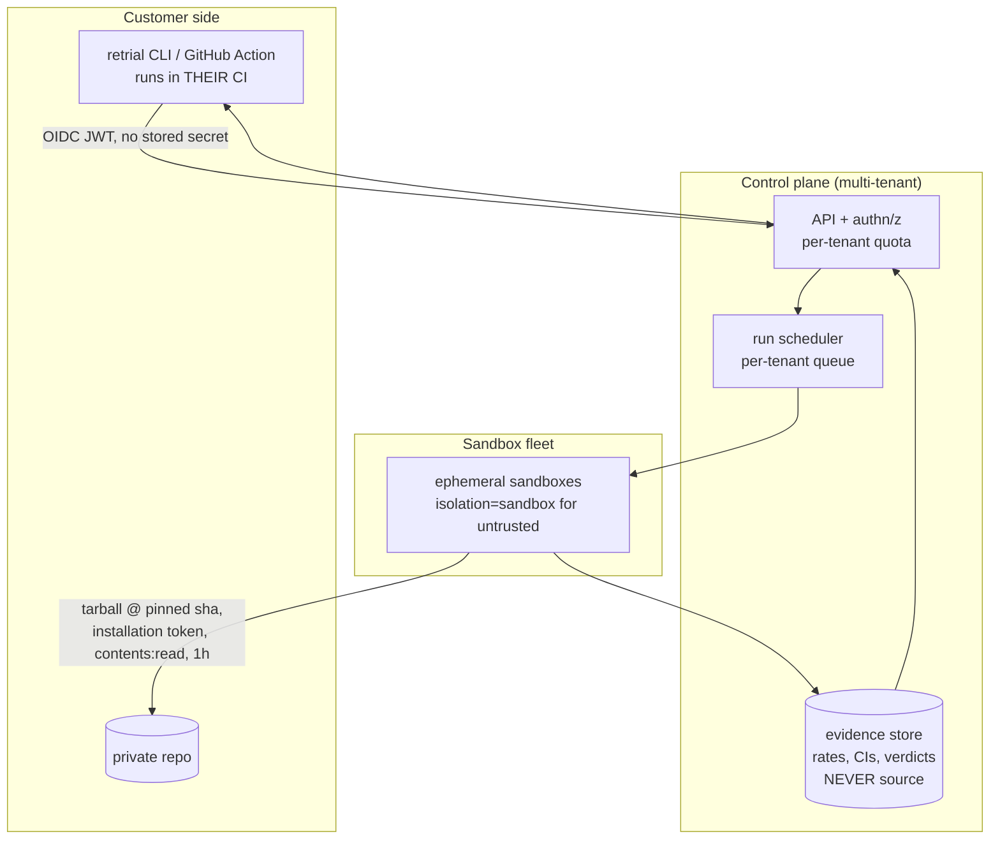

# Retrial as a product — system design, workflow, and the honest plan

Every number here was measured in this repo or fetched from a vendor's own page
on 2026-07-25, with the source named. Where something is a judgement call it says
RECOMMENDATION. Where something could not be verified it says so.

---

## 1. The one-sentence positioning, and why it is this one

Every incumbent detects flaky tests by **ingesting test results the customer's CI
already produced**. Verified:

| Product | Detection | Executes tests? |
|---|---|---|
| Trunk Flaky Tests | JUnit XML upload | no |
| Datadog Test Optimization | tracer/JUnit ingest; retries run in *the customer's* CI | no (not on Datadog compute) |
| BuildPulse | JUnit XML via reporter/Action | no |
| CircleCI Test Insights | `store_test_results` ingest | no |
| CircleCI **Chunk** (beta) | — | **yes**, on CircleCI VMs, to validate a fix |
| Semaphore **sem-ai** | native pipeline data | **yes**, "spinning up test boxes to run the test repeatedly" |
| CloudBees Smart Tests | predictive *selection*, different category | no |

A log is a record of what happened. It has **no counterfactuals**. So an
ingest-only product can tell you a test is unreliable, but it structurally cannot
answer *"would it still have failed with a different hash seed / timezone / test
order?"* — because that run never happened.

Retrial's swarm can run the counterfactual. That is the whole product.

> **Retrial reruns your test under conditions you choose — different hash seeds,
> timezones, locales, and test orders — and tells you which one flips it, with a
> Wilson 95% confidence interval on every number.**

Proven, on a real third-party repo (`goodmami/penman @ c2aaaf99`,
`tests/test_layout.py::test_rearrange`):

```
--order fixed    →  0/24 fail  ·  95% CI  0% – 14%  ·  INCONCLUSIVE
--order shuffle  → 11/12 fail  ·  95% CI 65% – 99%  ·  FLAKY
```

Disjoint intervals. An ingest-only tool sees "sometimes fails". Retrial says
*"it fails when test order perturbs the global RNG, and here is the interval."*

**What NOT to lead with.** "AI opens a PR that fixes your flaky test" closed as a
category between Oct 2025 and Jul 2026 — Datadog Bits AI, CircleCI Chunk,
Bitbucket, Semaphore (~$1–1.50/fix), Mergify. Retrial cannot differentiate there
and its tournament cannot even rank candidates at trial budgets ≤50. Keep the fix
path; stop selling it.

---

## 2. The user workflow

Persona: **platform-engineering lead, ~200-engineer Python shop, quarantine list
growing.** (GitLab's public numbers: 480 quarantined tests, +119% YoY, 159-day
average age, 38 with no owner.)

### Day 0 — first value, no account, no install

```bash
pipx install retrial
retrial repo --repo myorg/myservice \
             --ref $(git rev-parse HEAD) \
             --test "tests/test_billing.py::test_invoice_totals" \
             --order shuffle --runs 50
```

Prints a rate, a Wilson interval, and a verdict. No signup, no OAuth, no source
code leaving anywhere they don't control (it runs against *their* Daytona key, or
later against a hosted runner they opt into).

**Why this is the first integration and not a GitHub App:** every incumbent's
onboarding is "add an upload step to your CI" precisely because it needs no
org-admin approval, no security review, and no permissions negotiation. A CLI is
one step easier still. A GitHub App demands org-admin install — a much higher bar
for first touch.

### Day 1 — the diagnostic that no competitor can produce

```bash
retrial matrix tests/test_billing.py::test_invoice_totals
```

```
axis             flake           95% CI     n  err  verdict
control           44%        23% - 67%    16    0  FLAKY
hash_seed_0        0%         0% - 14%    24    0  INCONCLUSIVE
tz_auckland       56%        33% - 77%    16    0  FLAKY

IMPLICATED: hash_seed_0 stabilises the test (44% -> 0%)
```

That is a root cause, derived by experiment, with no LLM involved.

### Week 1 — the habit: a PR check

A GitHub Action on PRs that touch tests. Posts a Check Run:
*"Flake verdict: 47% (95% CI 33–61%, n=50, order=shuffle)"* — with annotations on
the exact file and line.

### Month 1 — the purchase: quarantine burndown

```bash
retrial amnesty --from-junit results.xml --quarantined quarantine.txt --runs 50
```

Ranked triage over the whole list. **Not** "safe to un-quarantine" — that is a
claim the data does not support. Instead:

> *312 of your 480 quarantined tests did not fail once in 50 isolated reruns
> AND 50 shuffled-order reruns. Ranked by interval width. 41 still fail >20%.
> 127 could not be measured — reasons attached.*

Against BuildPulse's 7-day and Datadog's 30-day **passive** clocks, the claim is
time-to-confidence, and it is honest.

---

## 3. System architecture



**What exists today** maps to: `verifier.py` (statistics), `trial.py` (one trial),
`pool.py` (fleet), `repo.py` (fetch+run), `matrix.py` (axes), `registry.py`
(observability), `history.py` (evidence store), `server.py` (API).

**What is genuinely new**, and each is a blocker:

| New | Why | Status |
|---|---|---|
| Per-tenant isolation | `isolation="process"` reuses sandboxes across runs, so untrusted repo A can leave state that alters repo B's verdict | **not started** — must force `isolation="sandbox"` for untrusted input, at 2.7 trials/s instead of 6.1 |
| Real authn/z | one global run lock, no tenancy | **not started** |
| Scoped repo access | see below | **not started** |
| Per-tenant spend ceiling | nothing aborts a run on budget | **not started** |

### How a private repo gets in without a broad token

The answer is a **GitHub App**, and the mechanics are verified:

- App permissions: **`Contents: read` only.** GitHub Apps take per-resource
  permissions; an OAuth App or classic PAT would require the blanket `repo`
  scope. ([docs.github.com — differences between GitHub Apps and OAuth Apps](https://docs.github.com/en/apps/oauth-apps/building-oauth-apps/differences-between-github-apps-and-oauth-apps))
- `POST /app/installations/{id}/access_tokens` mints an installation token that
  is **1 hour** long, scopable to **specific repositories** (`repository_ids`),
  and to a **subset** of the app's permissions. It can only ever narrow, never
  widen. ([REST API — create an installation access token](https://docs.github.com/en/rest/apps/apps?apiVersion=2022-11-28#create-an-installation-access-token-for-an-app))
- The sandbox therefore receives a token that reads exactly one repo, for one
  hour, and nothing else.

For the CI path, **GitHub Actions OIDC** removes the stored secret entirely: the
job requests a JWT (`permissions: id-token: write`), and the service exchanges it
for a short-lived credential scoped to that run.
([docs.github.com — security hardening with OpenID Connect](https://docs.github.com/en/actions/deployment/security-hardening-your-deployments/about-security-hardening-with-openid-connect))
Codecov already does exactly this (`use_oidc: true`).

**Data retention RECOMMENDATION: never persist source.** Store verdicts, rates,
intervals, and node ids. Mergify's published posture is the model — "processes
repository contents in memory and does not persist them"
([docs.mergify.com/security](https://docs.mergify.com/security/)). CodeRabbit
advertises "zero data retention post-review" with per-event ephemeral sandboxes
([coderabbit.ai/trust-center](https://www.coderabbit.ai/trust-center)) — and note
that Kudelski disclosed an RCE against that same sandbox reaching write access
across ~1M repos, so "ephemeral" is a claim to earn, not assert.

**`pull_request_target` is forbidden.** It runs with secrets and write access in
the base-repo context; checking out fork code under it is the classic
secret-exfiltration hole. Use `pull_request`, where `GITHUB_TOKEN` is read-only
and secrets are not passed.

---

## 4. Integration ladder, ranked by value ÷ effort

**1. CLI — done.** `retrial repo`, `retrial matrix`. No auth ceremony, works
locally and in CI, and it is the *only* surface that serves the amnesty use case
(there is no CI event to hook when the test isn't running).

**2. GitHub Action — the distribution channel.** A thin wrapper over the CLI.

```yaml
- uses: retrial/verify@v1
  with:
    test: tests/test_billing.py::test_invoice_totals
    runs: 50
    order: shuffle          # fixed | shuffle | both
    fail-on: 'ci-upper>10%' # gate the PR on the BOUND, not the point estimate
```

**3. GitHub App + Check Run.** Permissions `checks:write`, `contents:read`,
`pull_requests:write`. A Check Run's `output.summary` is Markdown; annotations
are capped at **50 per API call** and render in the PR's Files-changed tab
([REST — check runs](https://docs.github.com/en/rest/checks/runs?apiVersion=2022-11-28)).
Conclusion `neutral` for an informational verdict, `failure` only when a policy
threshold is breached.

**4. JUnit XML ingest.** The universal on-ramp both Trunk and BuildPulse chose:
`retrial amnesty --from-junit results.xml --top 20`. One parser buys every
language's test list — though Retrial can only *execute* Python today.

**5. MCP server.** ~50 lines, and CircleCI already proved the channel with
`find_flaky_tests`. Every coding agent becomes a distribution surface.

**Skip:** IDE extension (MCP supersedes it), Slack (undifferentiated — Buildkite
already ships it).

---

## 5. Unit economics — measured, and the conclusion is counter-intuitive

Daytona published rates ([daytona.io/pricing](https://www.daytona.io/pricing),
fetched 2026-07-25): **$0.0504/vCPU-hr, $0.0162/GiB-hr, $0.000108/GiB-hr disk**;
per-second billing; default sandbox 1 vCPU / 1 GiB / 3 GiB.

**One 50-trial verification.** 16 sandboxes, 5s bootstrap + 4 rounds × 2s:

| Resource | Cost |
|---|---|
| vCPU (208 sandbox-sec) | $0.00291 |
| RAM | $0.00094 |
| Disk | $0.00002 |
| **Total** | **≈ $0.004** |

**A 500-test batch at 50 trials each (25,000 trials): $0.93 – $1.94**, depending
on how often the bootstrap is paid.

**The baseline that makes the case.** The same 50 trials as 50 GitHub Actions
jobs, at $0.006/min for a Linux 2-core runner with **every job rounded up to a
whole minute**
([github/docs — actions runner pricing](https://github.com/github/docs/blob/main/content/billing/reference/actions-runner-pricing.md)):
**$0.30 — roughly 75× more expensive**, purely from billing granularity.

**The counter-intuitive part: sandbox compute is not the cost driver.** One
Fireworks diagnosis call is ~$0.008–0.010
([docs.fireworks.ai/serverless/pricing](https://docs.fireworks.ai/serverless/pricing)),
so **a single LLM call costs more than the entire 50-trial swarm that verifies
it.** Braintrust Pro is $249/mo base
([braintrust.dev/pricing](https://www.braintrust.dev/pricing)).

RECOMMENDATION: price on **verifications**, and let the measurement product carry
the margin. A verification costs ~$0.004 to serve. Semaphore benchmarks agentic
fixes at $1–1.50 each — that is the LLM path, and it is the expensive one. Selling
the *verdict* has ~99% gross margin; selling the *fix* does not.

---

## 6. The plan, in order

Each step ships something a user can use. The order is not negotiable — every
step below step 1 is a lie without it.

**1. Make the instrument honest on real input.** *(largely done this session)*
- ✅ junit-based verdicts — exit 1 is ambiguous (test-failure vs fixture-error)
- ✅ skipped/xfailed are not passes
- ✅ non-verdict outcomes excluded from the denominator, each with a named cause
- ✅ CORS locked; **auth still opt-in — this is the remaining blocker**

**2. Suite context as a first-class axis.** `--suite` exists. Fold it into
`matrix` so "isolated vs suite-context" is one report with disjoint-interval
discipline. This converts the largest class of Python flakiness from a silent
false negative into a named finding.

**3. `retrial amnesty`** over a list. Batch, ranked triage, no LLM. This is the
business case and it needs no new engine capability.

**4. GitHub Action.** Distribution.

**5. Tenancy + auth + spend ceilings.** The gate before anyone else's code runs
on your key. Forces `isolation="sandbox"`.

**6. GitHub App with `contents:read` installation tokens.** Private repos.

**Explicitly refused:** competing on auto-fix PRs; any new sponsor integration;
any UI work keyed to a fixed lane count or the `seeds/` directory.

---

## 7. What is still not true, stated plainly

- **No tenancy.** One run lock, one shared pool, `isolation="process"` reuses
  sandboxes across runs. Untrusted repos would share state. Not exposable.
- **Auth is opt-in and the UI does not send it.** `RETRIAL_AUTH_TOKEN` unset by
  default.
- **The tournament cannot rank.** At `MAX_TRIALS ≤ 50` only zero-failure
  candidates are eligible, so ties break alphabetically. Separation needs n ≥ 56.
- **The neutering guard is a deleted-assertion detector**, not a semantic
  preservation check. Its own docstring says so.
- **Python only**, and only pytest.
- **Retrial's own test suite has a ~50% flaky test** (`test_observatory_e2e.py::
  test_real_pool_trial_chain_feeds_the_endpoints_singleton`: 6/12 full-suite
  runs fail, 15/15 pass in isolation) — an order-dependent victim, exactly the
  class this document says is 59% of Python flakiness. It is not yet fixed.
  Dogfooding is not optional for a product that sells this.
